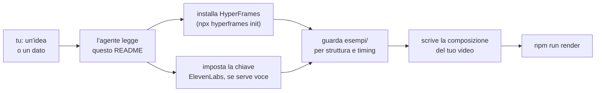

<p align="center">
  
</p>

<h1 align="center">motore-video-ai</h1>

<p align="center">
  <strong>E se la tua AI sapesse già come si fa un video?</strong><br>
  Le dai un'idea, un link o un dato: il video lo monta lei, zero software da aprire, zero codice da scrivere. Due reel veri, già pubblicati, sono usciti così.
</p>

<p align="center">
  <a href="LICENSE"></a>
  
  
</p>

<p align="center">
  <a href="#per-chi-è">Per chi è</a> ·
  <a href="#costruisci-il-tuo-video">Costruisci il tuo video</a> ·
  <a href="#esempi">Esempi</a> ·
  <a href="#le-scelte-che-lo-tengono-in-piedi">Le scelte</a> ·
  <a href="#cosa-non-fa">Cosa non fa</a>
</p>

Hai un'AI agentica (Claude Code, Codex, o equivalente) e vuoi un video: zero software da aprire, zero codice da scrivere, il montaggio lo fa lei. Un numero che sale, un confronto tra due dati, una domanda con la risposta, magari con una voce che lo spiega. Verticale, orizzontale, quadrato: il formato lo decidi tu.

Il render sa già farlo qualcun altro. Un motore per l'animazione, gli effetti sonori e la musica ([HyperFrames](https://hyperframes.heygen.com/)), un servizio per la voce ([ElevenLabs](https://elevenlabs.io/)). Il problema non è il rendering: è dire alla tua AI dove sono e come si usano insieme, senza installare o incollare niente a mano.

Questa cartella è quel puntatore. Due reel veri da guardare, e un'unica pagina che dice all'agente cosa installare e dove guardare.

---

## Guarda la demo in azione

[](https://www.youtube.com/watch?v=EVaiAJasAA0)

---

## Per chi è

- Hai un'AI agentica e le vuoi far costruire un video partendo da un dato o un'idea, non da zero in un editor.
- Non vuoi imparare un motore di animazione: vuoi che l'agente lo installi e lo usi da solo.
- Ti serve anche una voce narrante credibile, non solo grafica animata.

**Per chi non è:** se cerchi un editor puro, senza agente, questo non è il punto d'ingresso giusto. Qui è l'agente a scrivere la composizione.

---

## Costruisci il tuo video

Non scarichi né configuri niente a mano: lo fa l'agente, seguendo questa stessa pagina.

**1. Crea una cartella vuota** dove vuoi sul computer.

**2. Puntaci il tuo assistente**, Claude Code, Codex o equivalente, come cartella di lavoro.

**3. Incolla questo prompt e invia:**

```text
Scarica lo zip di https://github.com/Lucas-Grilli/motore-video-ai (branch main) ed estrai il contenuto direttamente in questa cartella. Poi cancella lo zip scaricato, apri README.md e segui da qui in poi la sezione "Costruisci il tuo video". Chiedimi cosa voglio costruire solo quando arrivi al punto in cui serve davvero.
```

**4. Da qui in poi è l'agente che legge il resto di questa sezione ed esegue:**

<details open>
<summary><b>Passi per l'agente</b></summary>

1. **Prerequisiti.** Verifica ed eventualmente installa: `node -v` (≥18), `ffmpeg -version`, `git --version`. Se mancano, installali per il sistema operativo rilevato prima di proseguire.
2. **Motore video: HyperFrames.** Non si scrive un motore di rendering da zero e non se ne vendorizza il codice qui dentro. Si installa dal suo pacchetto ufficiale:
   ```bash
   npx hyperframes init
   ```
   Il comando genera un progetto con la sua stessa documentazione (`AGENTS.md`/`CLAUDE.md`, `npx hyperframes docs <topic>`, indice completo su `https://hyperframes.heygen.com/llms.txt`). Leggila: è la fonte primaria per struttura, comandi e regole di composizione.
3. **Voce narrante: ElevenLabs.** Se il video ha bisogno di una voce, la chiave si legge da una variabile d'ambiente, mai da un file o da un prompt:
   ```bash
   export ELEVENLABS_API_KEY="..."   # macOS/Linux
   $env:ELEVENLABS_API_KEY = "..."   # Windows PowerShell
   ```
   Se manca, chiedila all'utente invece di inventare o saltare il passo. Modello consigliato: `eleven_multilingual_v2`.
4. **Guarda gli [esempi](#esempi)** prima di scrivere la tua composizione: mostrano struttura file, timing (`data-start`, `class="clip"`) e come si integra la voce quando c'è.
5. **Solo ora chiedi all'utente cosa vuole costruire**: argomento, formato, durata indicativa, se serve voce o no.
6. **Se qualcosa va ritoccato a mano dopo**, HyperFrames porta con sé un editor visivo (vedi [Le scelte](#le-scelte-che-lo-tengono-in-piedi)). Resta un extra: la maggior parte delle volte non serve.

</details>

<details>
<summary><b>Preferisci installare a mano?</b></summary>

Serve se lavori su claude.ai o sull'app dove l'assistente non scrive in una cartella del tuo computer, o se preferisci partire da git:

```bash
git clone https://github.com/Lucas-Grilli/motore-video-ai.git
cd motore-video-ai
npx hyperframes init
```

Poi apri una chat con il tuo assistente in quella cartella e scrivi cosa vuoi costruire.

</details>

---

## Come funziona



Nessun pezzo di questo repo genera un frame da solo. HyperFrames anima e mixa audio ed effetti, ElevenLabs parla, tu decidi il contenuto. Questa cartella mette i pezzi insieme e li mostra funzionare su casi veri.

---

## Esempi

Due reel realmente pubblicati, non demo giocattolo. Codice e asset in `esempi/`, sanificati da ogni riferimento privato. Entrambi hanno musica ed effetti sonori sincronizzati, non solo grafica.

<table>
<tr>
<td align="center" width="50%">
<br>
<b>Poltronave · Caffè V3</b><br>satira, no voce<br>
<sub><a href="esempi/poltronave-caffe/output/poltronave-caffe-v3-15s.mp4">🔊 versione con audio</a></sub><br><br>
<sub>Il prompt che ho usato:<br>«Guarda poltronave.it e fammi un video di lancio per i social, verticale, 15 secondi. Storytelling, mi raccomando.»</sub><br>
<sub><a href="https://poltronave.it">poltronave.it ↗</a></sub>
</td>
<td align="center" width="50%">
<br>
<b>DVNS · Calascio, Abruzzo</b><br>quiz narrato, con voce<br>
<sub><a href="esempi/dvns-calascio-abruzzo/output/calascio-master-v5.mp4">🔊 versione con audio</a></sub><br><br>
<sub>Flusso automatico che uso per i video di Dove Vanno I Nostri Soldi:</sub><br>
<sub><a href="https://x.com/DVNSoldi">@DVNSoldi ↗</a></sub>
</td>
</tr>
</table>

| Esempio | Cosa mostra | Voce | Fonte |
|---|---|---|---|
| [`poltronave-caffe/`](esempi/poltronave-caffe/) | Contatore satirico che sale, scontrino animato, musica chiptune originale | No | [poltronave.it](https://poltronave.it) |
| [`dvns-calascio-abruzzo/`](esempi/dvns-calascio-abruzzo/) | Quiz narrato su un comune d'Abruzzo, voce ElevenLabs sincronizzata parola per parola, mappa animata | **Sì** | [dovevannoinostrisoldi.com](https://www.dovevannoinostrisoldi.com/) |

**Dove Vanno I Nostri Soldi** è un sistema editoriale sui conti pubblici italiani, dati verificati, registro apartisan. Il codice di questo esempio è la loro repo, qui dentro. **Poltronave** è un contatore satirico del debito pubblico, parodia dichiarata di nyan cat. I due progetti restano separati anche qui: mai la stessa scena, mai lo stesso branding.

Ogni cartella ha un suo `README.md` con i comandi di rendering. Entrambi sono verticali 9:16 per scelta editoriale di chi li ha pubblicati, non per un vincolo del motore.

---

## Le scelte che lo tengono in piedi

- **Puntatore, non pacchetto.** HyperFrames non è vendorizzato: si installa dal suo pacchetto ufficiale (`npx hyperframes`), che porta con sé la propria documentazione sempre aggiornata. Vendorizzarlo qui vorrebbe dire congelare una versione e perdere ogni fix a monte.
- **La chiave non è mai nel repo.** Solo variabile d'ambiente, mai in un file, un prompt o un log.
- **Due esempi, non uno.** Uno satirico senza voce, uno serio con voce narrata: coprono le due combinazioni che contano di più.
- **Il prompt che incolli è minuscolo apposta.** Le istruzioni vere stanno in questo README, non nel prompt, così restano aggiornabili senza che tu debba ricordare o reincollare niente di nuovo.
- **C'è anche un editor visivo**, se ti serve. HyperFrames porta con sé uno Studio locale (canvas, timeline, layer, inspector: `npx hyperframes preview --background`), dove puoi selezionare un elemento e descrivere la correzione invece di riscrivere codice. Guardare non consuma un token: il costo entra solo quando chiedi davvero una modifica. Resta un di più: la maggior parte delle volte l'agente finisce senza bisogno di aprirlo.

---

## Cosa non fa

Non genera voci (le genera ElevenLabs, con una chiave tua) e non decide il contenuto: dato, angolo e copione restano una scelta di chi lo usa.

---

## Crediti

Il motore di rendering è [HyperFrames](https://hyperframes.heygen.com/) (HeyGen); la voce è [ElevenLabs](https://elevenlabs.io/). Gli esempi includono [GSAP](https://gsap.com/) (GreenSock, gratuito) per l'animazione e il font [Geist](https://vercel.com/font) (Vercel, SIL Open Font License).

---

## Licenza

MIT, vedi [LICENSE](LICENSE). Il codice è libero; gli esempi restano soggetti alle regole dei rispettivi progetti se li riusi come contenuto (satira dichiarata per Poltronave, dato verificato e apartisan per DVNS), non se li guardi solo come codice.

---

## Feedback

Critiche, casi che non copre, pattern HyperFrames che mancano: scrivetemi in qualsiasi momento.
