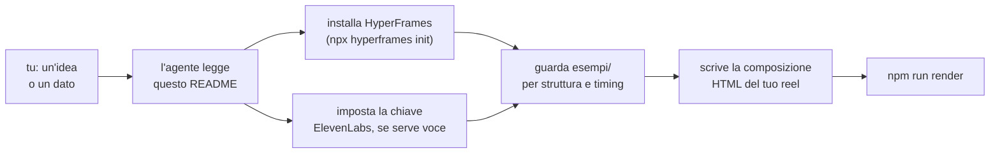

<p align="center">
  
</p>

<h1 align="center">motore-reels-ai</h1>

<p align="center">
  <strong>Il motore non sta qui dentro. Ci sta il modo di trovarlo.</strong><br>
  Non una libreria di componenti video: la cartella che dice alla tua AI agentica dove sono il motore di rendering e la voce, e le mostra due reel veri per farglielo capire.
</p>

<p align="center">
  <a href="LICENSE"></a>
  
  
</p>

<p align="center">
  <a href="#per-chi-è">Per chi è</a> ·
  <a href="#costruisci-il-tuo-reel">Costruisci il tuo reel</a> ·
  <a href="#come-funziona">Come funziona</a> ·
  <a href="#esempi">Esempi</a> ·
  <a href="#le-scelte-che-lo-tengono-in-piedi">Le scelte</a> ·
  <a href="#cosa-non-fa">Cosa non fa</a>
</p>

Hai un'AI agentica (Claude Code, Codex, o equivalente) e vuoi che ti costruisca un reel verticale: un numero che sale, un confronto tra due dati, una domanda con la risposta, magari con una voce che lo spiega. Il render sa già farlo qualcun altro — un motore per l'animazione ([HyperFrames](https://hyperframes.heygen.com/)), un servizio per la voce ([ElevenLabs](https://elevenlabs.io/)). Il problema non è il rendering: è dire alla tua AI dove sono e come si usano insieme, senza installare o incollare niente a mano.

Questa cartella è quel puntatore. Non un motore, non un framework tutto suo: due reel veri da guardare e un'unica pagina che dice all'agente cosa installare e dove guardare.

---

## Guarda la demo in azione

> 🎬 *Demo video in arrivo — nel frattempo, gli [esempi](#esempi) qui sotto sono reel reali, già online.*

---

## Per chi è

- Hai un'AI agentica e le vuoi far costruire un video verticale (Reel/TikTok/Short) partendo da un dato o un'idea, non da un editor a timeline.
- Non vuoi imparare un motore di animazione: vuoi che l'agente lo installi e lo usi da solo.
- Ti serve anche una voce narrante credibile, non solo grafica animata.
- Hai già Node e un terminale, ma non vuoi configurare nulla a mano oltre a una chiave API.

**Per chi non è:** se cerchi un editor video con timeline da trascinare, questo non lo è — è un motore che un'AI pilota scrivendo codice, non un'interfaccia da usare col mouse.

---

## Costruisci il tuo reel

Non scarichi né configuri niente a mano: lo fa l'agente, seguendo questa stessa pagina.

**1. Crea una cartella vuota** dove vuoi sul computer.

**2. Puntaci il tuo assistente** — Claude Code, Codex o equivalente, come cartella di lavoro.

**3. Incolla questo prompt e invia:**

```text
Scarica lo zip di https://github.com/Lucas-Grilli/motore-reels-ai (branch main) ed estrai il contenuto direttamente in questa cartella. Poi cancella lo zip scaricato, apri README.md e segui da qui in poi la sezione "Costruisci il tuo reel" — chiedimi cosa voglio costruire solo quando arrivi al punto in cui serve davvero.
```

**4. Da qui in poi è l'agente che legge il resto di questa sezione ed esegue:**

<details open>
<summary><b>Passi per l'agente</b></summary>

1. **Prerequisiti** — verifica ed eventualmente installa: `node -v` (≥18), `ffmpeg -version`, `git --version`. Se mancano, installali per il sistema operativo rilevato prima di proseguire.
2. **Motore video: HyperFrames.** Non si scrive un motore di rendering da zero e non se ne vendorizza il codice qui dentro — si installa dal suo pacchetto ufficiale:
   ```bash
   npx hyperframes init
   ```
   Il comando genera un progetto con la sua stessa documentazione (`AGENTS.md`/`CLAUDE.md`, `npx hyperframes docs <topic>`, indice completo su `https://hyperframes.heygen.com/llms.txt`): leggila, è la fonte primaria per struttura, comandi (`npm run dev`, `npm run render`, `npm run check`) e regole di composizione. Non improvvisare un formato diverso da quello che quei file descrivono.
3. **Voce narrante: ElevenLabs.** Se il reel ha bisogno di una voce, la chiave si legge da una variabile d'ambiente, mai da un file o da un prompt:
   ```bash
   export ELEVENLABS_API_KEY="..."   # macOS/Linux
   $env:ELEVENLABS_API_KEY = "..."   # Windows PowerShell
   ```
   Se manca, chiedila all'utente invece di inventare o saltare il passo. Modello consigliato: `eleven_multilingual_v2`.
4. **Guarda gli [esempi](#esempi)** prima di scrivere la tua composizione: mostrano struttura file, timing (`data-start`, `class="clip"`) e come si integra la voce quando c'è.
5. **Solo ora chiedi all'utente cosa vuole costruire** — argomento, durata indicativa, se serve voce o no — e costruisci sul progetto HyperFrames appena installato.

</details>

<details>
<summary><b>Preferisci installare a mano?</b></summary>

Serve se lavori su claude.ai o sull'app dove l'assistente non scrive in una cartella del tuo computer, o se preferisci partire da git:

```bash
git clone https://github.com/Lucas-Grilli/motore-reels-ai.git
cd motore-reels-ai
npx hyperframes init
```

Poi apri una chat con il tuo assistente in quella cartella e scrivi cosa vuoi costruire.

</details>

---

## Come funziona



Nessun pezzo di questo repo genera un frame da solo: HyperFrames anima e renderizza, ElevenLabs parla, tu decidi il contenuto. Questa cartella mette i tre insieme e li mostra funzionare su casi veri.

---

## Esempi

Due reel realmente pubblicati, non demo giocattolo — codice e asset in `esempi/`, sanificati da ogni riferimento privato.

| Esempio | Cosa mostra | Voce | Fonte |
|---|---|---|---|
| [`poltronave-caffe/`](esempi/poltronave-caffe/) | Contatore satirico che sale, scontrino animato, musica chiptune originale | No | [poltronave.it](https://poltronave.it) |
| [`dvns-calascio-abruzzo/`](esempi/dvns-calascio-abruzzo/) | Quiz narrato su un comune d'Abruzzo, voce ElevenLabs sincronizzata parola per parola, mappa animata | **Sì** | [dovevannoinostrisoldi.com](https://www.dovevannoinostrisoldi.com/) |

**Dove Vanno I Nostri Soldi** è un sistema editoriale sui conti pubblici italiani (dati verificati, registro apartisan); il codice di questo esempio è la loro repo, qui dentro. **Poltronave** è un contatore satirico del debito pubblico, parodia dichiarata di nyan cat — i due progetti restano separati anche qui: mai la stessa scena, mai lo stesso branding.

Ogni cartella ha un suo `README.md` con i comandi di rendering e cosa cambia rispetto all'altro.

---

## Le scelte che lo tengono in piedi

- **Puntatore, non pacchetto.** HyperFrames non è vendorizzato: si installa dal suo pacchetto ufficiale (`npx hyperframes`), che porta con sé la propria documentazione sempre aggiornata. Vendorizzarlo qui vorrebbe dire congelare una versione e perdere ogni fix a monte.
- **La chiave non è mai nel repo.** Solo variabile d'ambiente, mai in un file, un prompt o un log.
- **Due esempi, non uno.** Uno satirico senza voce, uno serio con voce narrata: coprono le due variabili che contano di più (con/senza narrazione, registro serio/registro satira) invece di un solo caso che lascia indovinare il resto.
- **Il prompt che incolli è minuscolo apposta.** Le istruzioni vere stanno in questo README, non nel prompt: così restano aggiornabili senza che tu debba ricordare o reincollare niente di nuovo.

---

## Cosa non fa

**Non è un motore di rendering.** Anima e renderizza HyperFrames; questo repo lo installa e lo punta, non lo sostituisce.

**Non genera voci.** Le genera ElevenLabs, con una chiave tua.

**Non ha un editor.** Si pilota scrivendo composizioni HTML/JS, non trascinando clip su una timeline.

**Non decide il contenuto.** Il dato, l'angolo, il copione restano una scelta di chi lo usa — il repo non inventa cosa dire, solo come costruirlo.

---

## Crediti

Il motore di rendering è [HyperFrames](https://hyperframes.heygen.com/) (HeyGen); la voce è [ElevenLabs](https://elevenlabs.io/). Gli esempi includono [GSAP](https://gsap.com/) (GreenSock, gratuito) per l'animazione e il font [Geist](https://vercel.com/font) (Vercel, SIL Open Font License).

---

## Licenza

MIT — vedi [LICENSE](LICENSE). Il codice è libero; gli esempi restano soggetti alle regole dei rispettivi progetti se li riusi come contenuto (satira dichiarata per Poltronave, dato verificato e apartisan per DVNS), non se li guardi solo come codice.

---

## Feedback

Critiche, casi che non copre, pattern HyperFrames che mancano: scrivetemi in qualsiasi momento.
